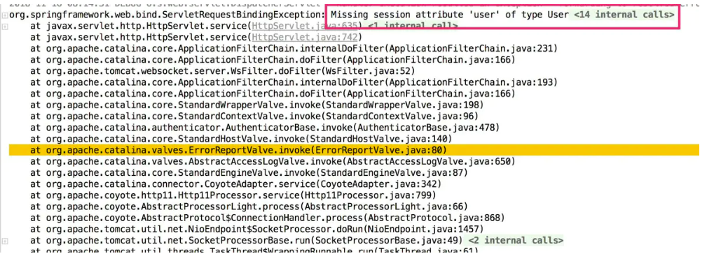
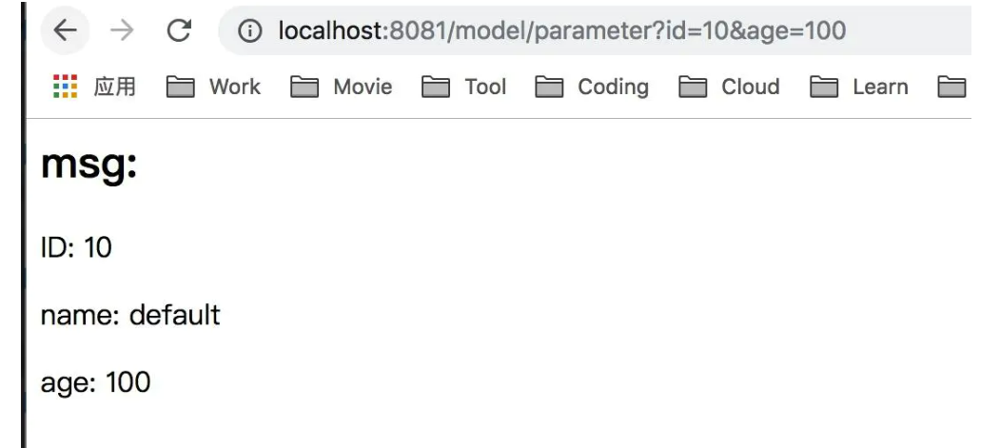
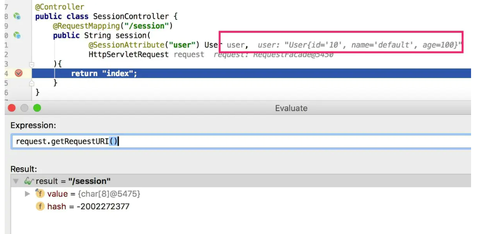

# Spring MVC的请求映射注解 #
|注解|描述|
|---|:---:|
|@RequestMapping|通用的请求处理|
|@GetMapping|处理HTTP GET请求|
|@PostMapping|处理HTTP POST请求|
|@PutingMapping|处理HTTP PUT请求|
|@DeleteMapping|处理HTTP DELETE请求|
|@PatchMapping|处理HTTP PATCH请求|

#注解解释#

## @SpringBootApplication是一个组合注解，它组合了3个其他的注解。 ##

- @SpringBootConfiguration：将该类声明为配置类。这个注解实际上是@Configuration注解的特殊形式。
- @EnableAutoConfiguration：启用Spring Boot的自动配置。
- @ComponentScan：启用组件扫描。这样我们能够通过像@Component、@Controller、@Service这样的注解声明其他类，Spring会自动发现它们并将它们注册为Spring应用上下文中的组件。
 
## @Valid 注解类型 ##
**@Valid**注解可以实现数据的验证，你可以定义实体，在实体的属性上添加校验规则，而在API接收数据时添加@valid关键字，这时你的实体将会开启一个校验的功能。
**@Null**
限制只能为null
**@NotNull**
限制必须不为null
**@AssertFalse**
限制必须为false
**@AssertTrue**
限制必须为true
**@DecimalMax(value)**
限制必须为一个不大于指定值的数字
**@DecimalMin(value)**
限制必须为一个不小于指定值的数字
**@Digits(integer,fraction)**
限制必须为一个小数，且整数部分的位数不能超过integer，小数部分的位数不能超过fraction
**@Future**
限制必须是一个将来的日期
**@Max(value)**
限制必须为一个不大于指定值的数字
**@Min(value)**
限制必须为一个不小于指定值的数字
**@Past**
限制必须是一个过去的日期
**@Pattern(value)**
限制必须符合指定的正则表达式
**@Size(max,min)**
限制字符长度必须在min到max之间
**@Past**
验证注解的元素值（日期类型）比当前时间早
**@NotEmpty**
验证注解的元素值不为null且不为空（字符串长度不为0、集合大小不为0）
**@NotBlank**
验证注解的元素值不为空（不为null、去除首位空格后长度为0），不同于@NotEmpty，@NotBlank只应用于字符串且在比较时会去除字符串的空格
**@Email**
验证注解的元素值是Email，也可以通过正则表达式和flag指定自定义的email格式

## @Autowired ##
### Spring中@Autowired 注解的注入规则 ###
默认根据类型，匹配不到则根据bean名字
**1.声明一个service接口**

```java
public interface HelloService {
    void sayHello();
}
```
**2.service接口的实现类，此时bean名字是 helloServiceImpl**
```java
@Service
public class HelloServiceImpl implements HelloService {
    @Override
    public void sayHello() {
        System.out.println("say hello impl");
    }
}
```
**3.增加一个Controller，注入service**
```java
// 生成一个bean，名字为 helloController
@Controller
public class HelloController {
    @Autowired
    private HelloService helloService;
    
    public void hello() {
        helloService.sayHello();
    }
}
```
**4.测试①：**
```java
public class AppTest {
    
    public static void main(String[] args) {
        ApplicationContext context = new ClassPathXmlApplicationContext("applicationContext.xml");
        HelloController controller = (HelloController) context.getBean("helloController");
        controller.hello();
    }
}
```
结果如下
say hello impl

成功将Service层的实现类注入到Controller层中，可以把步骤3 代码修改一下
```java
// 生成一个bean，名字为 helloController
@Controller
public class HelloController {
    @Autowired
    private HelloService abc;
    
    public void hello() {
        abc.sayHello();
    }
}
```
结果也是可以的，因为@Autowired 第一是按照类型去匹配的，此时IoC容器中HelloService 接口只有一个实现类，所以属性名字怎么写都没关系，都可以注入进去
**测试②：增加一个实现类，此时bean名字是 newHelloServiceImpl**
```java
@Service
public class NewHelloServiceImpl implements HelloService {
    @Override
    public void sayHello() {
        System.out.println("new say hello impl");
    }
}
```
现在IoC容器中有两个 HelloService接口的实现类，继续运行测试方法，结果为
 
Caused by: org.springframework.beans.factory.UnsatisfiedDependencyException: 
Error creating bean with name 'helloController': 
Unsatisfied dependency expressed through field 'abc'; 
nested exception is org.springframework.beans.factory.NoUniqueBeanDefinitionException: 
No qualifying bean of type 'com.convict.service.HelloService' available: 
expected single matching bean but found 2: helloServiceImpl,newHelloServiceImpl

因为一个接口有多个实现，所以@Autowired 就按照属性名字去找，即找一个名字为 abc的bean注入，然而IoC容器不存在一个名字叫abc的 bean，因此报错，把属性名改为下面任意一种就可以匹配到了
```java
// 生成一个bean，名字为 helloController
@Controller
public class HelloController {
    @Autowired
    private HelloService helloServiceImpl;
    
    @Autowired
    private HelloService newHelloServiceImpl;
    
    public void hello() {
        helloServiceImpl.sayHello();
        newHelloServiceImpl.sayHello();
    }
}
```
say hello impl
new say hello impl

**测试③：**

那我就要把属性名叫 abc，同时有多个实现，而且还能注入，那么在声明组件的时候取个名字就好了，比如
```java
@Service("abc")
public class HelloServiceImpl implements HelloService {
    @Override
    public void sayHello() {
        System.out.println("say hello impl");
    }
}
```
然后Controller 注入的还是abc，结果注入成功
```java
// 生成一个bean，名字为 helloController
@Controller
public class HelloController {
    @Autowired
    private HelloService abc;
    
    public void hello() {
        abc.sayHello();
    }
}
```
say hello impl

**测试④：**

属性名叫 abc，同时有多个实现，同时可以注入，且不在注解处声明bean 的名字，那么这时候使用新的注解@Qualifier 配合@Autowired 一起使用

```java
@Controller
public class HelloController {
    @Autowired
    @Qualifier("helloServiceImpl")
    private HelloService abc;
    
    public void hello() {
        abc.sayHello();
    }
}
```
say hello impl
@Qualifier是指定 一个bean的名字

**总结：**
1.一个接口只有一个实现的情况下，属性名字怎么写都无所谓，因为按照类型匹配就只有一个bean
2.一个接口多个实现的情况下：
　　① 属性名字跟组件名字一致，组件名字可以在声明的时候指定，比如 @Service("abc")
 　　② 属性名字跟组件名字不一致，配合@Qualifier 注解指定组件名字

## @Repository 注解##
在Spring2.0之前的版本中，@Repository注解可以标记在任何的类上，用在表明该类是用来执行与数据库相关的操作（即dao对象),并支持自动处理数据库操作产生的异常
在Spring2.5版本中，引入了更多的Spring类注解：@Component，@Service，@Controller。Component是一个通用的Spring容器管理的单例bean组件。而@Repository，@Service，@Controller
因此，当你的一个类被@Component所注解，那么就意味同样可以用@Repository，@Service，@Controller来替代它，同时这些注解会具备有更多的功能，而且功能各异。
最后，如果你不知道要在项目的业务层采用@Service还是@Component注解。那么，@Service是一个更好的选择。
就如上文所说的，@Repository早已被支持了在你的持久层作为一个标记可以去自动处理数据库操作产生的异常（译者注：因为原生的java操作数据库所产生的异常只定义了几种，但是产生数据库异常的原因却有很多种，这样对于数据库操作的报错排查造成了一定的影响；而Spring拓展了原生的持久层异常，针对不同的产生原因有了更多的异常进行描述。
所以，在注解了@Repository的类上如果数据库操作中抛出了异常，就能对其进行处理，转而抛出的是翻译后的Spring专属数据库异常，方便我们对异常进行排查处理。
通过上面的话来看就是如果是数据库持久层的就使用@Repository
根据SpringDataJPA的项目，我们会首先定义一个接口，在这个接口上可能会继承CrudRepository。
如下面的代码
```java
@Repository
public interface VisaCheckeeRepository extends CrudRepository<VisaCheckee, Long> {

    VisaCheckee findVisaCheckeeByCheckeeVisaId(String checkeeVisaId);

}
```
上面的代码中，就算不使用@Repository
当然我们还是建议使用@Repository
如果你还是实现类的话，也记得把你的实现类用@Repository

如果，我们来看看上面的图，就能比较直观的了解@Repository
## @SessionAttributes ##
@SessionAttributes用于在会话中存储Model的属性，一般作用在类的级别。像下面的代码，model的属性user会被存储到session中，因为@ModelAttribute与@SessionAttributes有相同的注解。
```java
@Controller
@SessionAttributes("user")
public class ModelController {
    
    @ModelAttribute("user")
    public User initUser(){
        User user =new User();
        user.setName("default");
        return user;
    }
}
```
@SessionAttribute是用于获取已经存储的session数据，并且作用在方法的层面上。
```java
@RequestMapping("/session")
public String session(
    @SessionAttribute("user") User user
){
    //do something
    return "index";
}
```
### 实例 ###
1.准备@SessionAttributes的文件，用于存储session
```java
@Controller
@RequestMapping("/model")
@SessionAttributes("user")
public class ModelController {
    
    @ModelAttribute("user")
    public User initUser(){
        User user = new User();
        user.setName("default");
        return user;
    }
    @RequestingMapping("/parmeter")
    public String parameter(
        @ModelAttribute("user") User user
    ){
        return "index";
    }
}
```
2.准备@SessionAttribute的文件，用于检索session，以验证注解是否正确。
```java
@Controller
public class SessionController {
    @RequestMapping("/session")
    public String session (
@SessionAttribute("user") User user,HttpServletRequest request
    ){
        return "index";
    }
}
```
3.进行测试
不经过@SessionAttributes会直接报错

先经过@SessionAttributes
首先访问/model/parameter的url

然后访问/session的url。这个地址，我们没有传递任何参数，可以看到从session中获取user对象成功了
